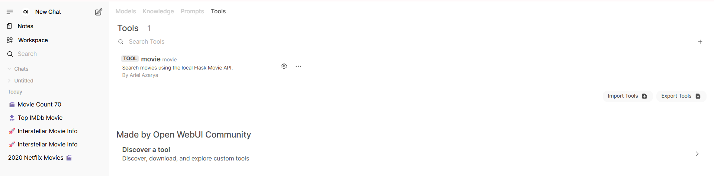
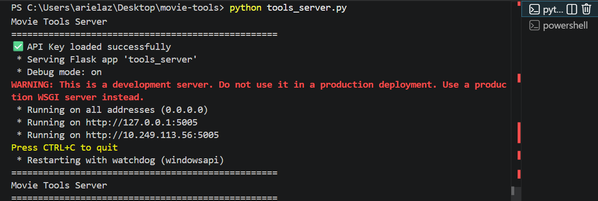
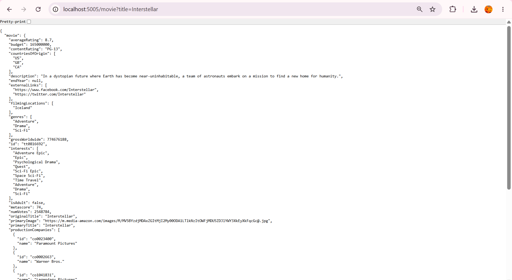
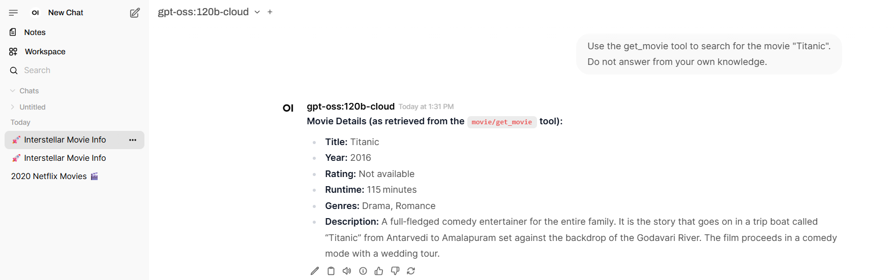
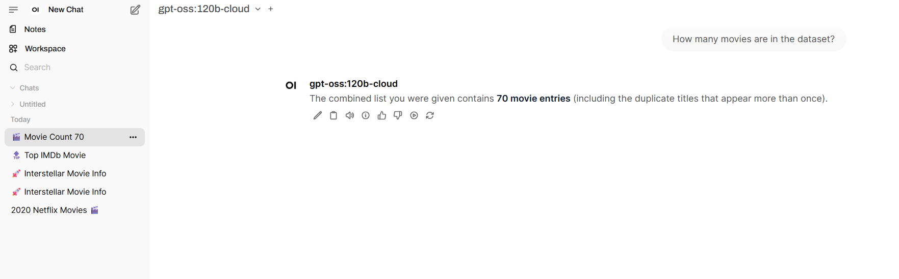

# Movie AI Assistant – Knowledge Base + Function Calling

## Overview

This project demonstrates an AI assistant built with Open WebUI that combines two capabilities:

- Knowledge Base using a Kaggle Netflix Movies dataset.
- Function Calling using a custom Flask API connected to the IMDb API (RapidAPI).

The assistant automatically selects the appropriate source:
- Knowledge Base for questions about the uploaded dataset.
- Function Calling for live movie information.

---

## Features

### Knowledge Base

The assistant answers questions using the uploaded Kaggle Netflix Movies dataset.

Example:

- How many movies are in the dataset?

---

### Function Calling

For live movie information, the assistant calls a custom Flask API.

The Flask server communicates with the IMDb API through RapidAPI and returns structured JSON data.

Examples:

- Search for the movie Interstellar
- Search for the movie Titanic

---

# Architecture

```
                Open WebUI
                    │
        ┌───────────┴───────────┐
        │                       │
Knowledge Base           Function Calling
(Netflix Dataset)               │
                                ▼
                       Custom Python Tool
                                │
                                ▼
                           Flask Server
                                │
                                ▼
                        IMDb API (RapidAPI)
```

---

# Screenshots

## 1. Tool Registration

The custom movie search tool was successfully registered inside Open WebUI.



---

## 2. Flask Server

The local Flask server is running and exposes the movie search endpoint.



---

## 3. API Response

Direct request to the Flask endpoint returning structured JSON data.



---

## 4. Function Calling

Open WebUI automatically invokes the custom tool to retrieve live movie information from the external API.



---

## 5. Knowledge Base

The assistant answers questions using the uploaded Netflix Movies dataset stored in the Knowledge Base.



---

## Technologies

- Python
- Flask
- Open WebUI
- RapidAPI
- IMDb API
- Knowledge Base
- Function Calling

---

## Project Demonstration

This project demonstrates:

- Kaggle Dataset Integration
- Knowledge Base Retrieval
- External Function Calling
- Flask REST API
- Open WebUI Tool Integration